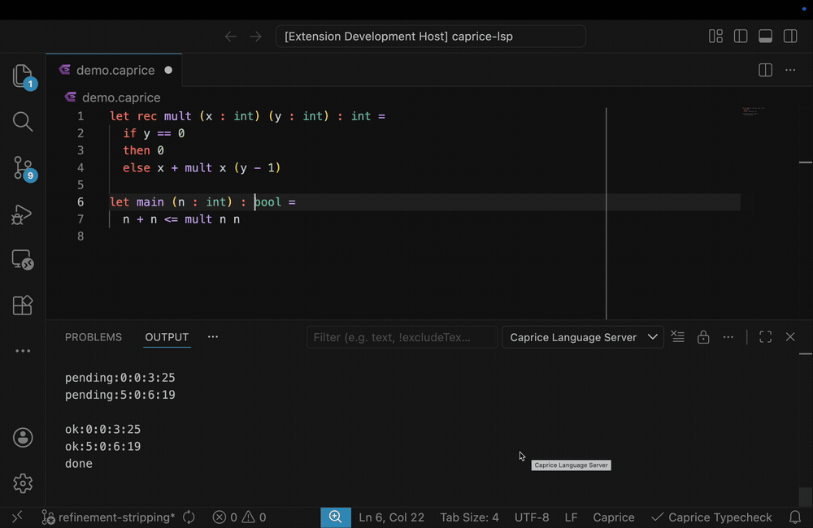

# Caprice Live Type Checking — Architecture

> A concolic, refinement-type checker made interactive through cooperative
> scheduling, per-statement execution, and effect-based incremental diagnostics.

## Overview

Turns Caprice from a one-shot CLI checker (`./typecheck.exe file.caprice`) into a
streaming, **per-statement** LSP backend with sub-second feedback. The backend is
**long-lived** across edits, preserving scheduling state and avoiding cold starts.

## Demo

## Architecture

Three layers:

1. **VS Code client** — `client/src/extension.ts`: activation, status-bar toggle.
2. **TypeScript LSP server** — `server/src/`: owns the OCaml process, frames packets, debounces, manages diagnostics.
3. **OCaml backend** — `caprice_typecheck_lsp.exe` (`../src/bin`, `../src/lsp`, `../src/parsing`): parsing, scheduling, checking.

Transport:

- Client ↔ server: LSP / JSON-RPC.
- Server → OCaml: length-framed JSON `{uri, version, fullText, changes}` over stdin.
- OCaml → server: newline-delimited **tagged lines** (`pending:` `ok:` `error:` `splay_error:` `refinement_warning:`) over stdout, terminated by `done`.

## Core mechanisms

### Per-statement checking — `src/lsp/stmt_check.ml`

`do_check : bool` annotation flag (`src/lang/ast.ml`). Disabled statements still bind
names/types but skip expensive checking. `mk_pgms` emits **one program per statement**,
with exactly that statement checked and all others disabled. Enables partial checking,
incremental scheduling, and cancellation.

### Position-tracked AST — `src/lang/ast.ml`, `src/parsing/parser.mly`

`pos_span` threaded through statements (`statement_with_pos`). Spans are the **identity**
of a diagnostic end-to-end (OCaml → wire → TS `rangeKey`), so diagnostics survive edits
and stale ones can be evicted by line.

### Functorized parser — `src/parsing/param.ml`, `parse.ml`

Menhir `%parameter<Param : Param.S>` instantiates one grammar two ways: `Standard` builds
full refinement nodes; `Make_ignore_refine` strips predicates and records their spans.
No grammar duplication; enables refinement-erased checking (`parse_stripped`).

### Cooperative scheduler — `src/lsp/scheduler.ml`

OCaml 5 effects. The concolic loop (functor over `yield`, `src/concolic/loop.ml`) performs
`Pause` each step; `round_robin` catches it, captures the continuation, and re-enqueues —
round-robin turn-taking. Scheduler result type: `Done | Cont k | Spawn items | Cancel_peers span`.
Gives fairness, interruptibility, cancellation, and non-blocking editing.

### Splay-failure diagnosis — `src/lsp/main_loop.ml` (`handle_fallback`)

Refinements can make "splay" search report spurious failures. Pipeline:

1. **Parse twice** (full + stripped) via the functorized parser.
2. **Race** (`Spawn`): splay-on-stripped vs. full non-splay check; `Cancel_peers` kills the loser.
3. **Explain**: if stripped succeeds but full fails, the refinement caused it → emit
   `refinement_warning` at the refinement span.

### Baseline pre-pass — `src/lsp/main_loop.ml` (`find_baseline_error`)

Run an all-checks-disabled pass first to catch evaluation/runtime errors before expensive
symbolic checking, then truncate scheduling before the first failing statement.

## Editor UX — `server/src/diagnostics.ts`

- 250 ms delay before the "checking…" underline.
- 1 s parse-error debounce.
- Stale eviction by edit line; diagnostics keyed by range.
- Splay/refinement failures render as separate `:splay` / `:refinement` diagnostics.
- Status-bar toggle (`client/src/extension.ts`) without reload.

## Code map

| File | Responsibility |
|---|---|
| `src/parsing/param.ml` | full vs. stripped refinement functor |
| `src/parsing/parse.ml` | parser entry points, `parse_stripped` |
| `src/lsp/protocol.ml` | inbound JSON packet parsing |
| `src/lsp/stmt_check.ml` | per-statement program generation |
| `src/lsp/range_check.ml` | edit range → statement to check |
| `src/lsp/scheduler.ml` | effect-based round-robin |
| `src/lsp/main_loop.ml` | orchestration, baseline, splay fallback |
| `src/lsp/print.ml` | outbound tagged lines |
| `src/bin/caprice_typecheck_lsp.ml` | framed stdin/stdout loop |
| `server/src/server.ts` | process owner, framing, restart-to-cancel |
| `server/src/diagnostics.ts` | diagnostic state machine, debouncing |
| `server/src/protocol.ts` | wire format (both directions) |
| `client/src/extension.ts` | activation, status-bar toggle |

## Five ideas that made it work

1. Long-lived backend with framed JSON + tagged stdout.
2. OCaml 5 effects for cooperative scheduling.
3. Position spans as diagnostic identity.
4. Baseline pre-pass to prioritize concrete failures.
5. Menhir `%parameter` for dual AST generation.

## Future work

- Surface splay errors as CodeLens (in progress, not yet merged).
- 0.5 s delay before checking; more efficient daemon task cancellation.
- Log restart frequency; stack traces for errors.
- Replace linear scans with binary search.
- Quantitative latency measurements; comparison with traditional LSP architectures.
